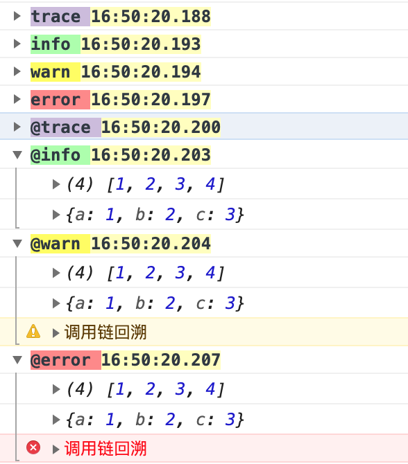

# logger-typescript

**[EN]** A self-use logger for typescript

**[CN]** 自用的 typescript 分级日志

## Example

```typescript
import { Logger as logger, E_Log_Level } from "./Logger";

logger.setLevel(E_Log_Level.Trace);

//普通输出不会展开
let groups = [[1, 2, 3, 4], { a: 1, b: 2, c: 3 }];
logger.trace("trace", ...groups);
logger.info("info", ...groups);
logger.warn("warn", ...groups);
logger.error("error", ...groups);

//添加@前缀自动展开
logger.trace("@trace", ...groups);
logger.info("@info", ...groups);
logger.warn("@warn", ...groups);
logger.error("@error", ...groups);
```


